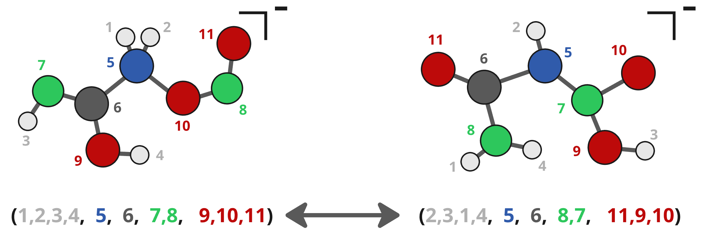

For installation of Moltric, use pip: `pip install moltric`

For questions or suggestions for features to add, contact Kazuumi Fujioka: kazuumi@hawaii.edu


# Introduction

<p align="center">

</p>

<p align="justify">
Blah blah blah...
</p>

Consider the reaction below:

$$
\textrm{CH} + \textrm{C}_4 \textrm{H}_6 \longrightarrow \textrm{C}_5 \textrm{H}_6 + \textrm{H}
$$


## Comparing two sets of molecules:

From a terminal, prepare two xyz files of the two sets of molecules. Then call Moltric, like so:

```
moltric/moltric.py examples/fromFujioka_CH.indene_19atoms.xyz examples/fromFujioka_CH.indene_19atoms.xyz
```

this produces:

```
# Number of points found in 'examples/fromFujioka_CH.indene_19atoms.xyz': 81
# Number of points found in 'examples/fromFujioka_CH.indene_19atoms.xyz': 81
#    i    j      DMD
/home/kazuumi/.conda/envs/sgdmlSTUFF/lib/python3.11/site-packages/ot/bregman/_sinkhorn.py:666: UserWarning: Sinkhorn did not converge. You might want to increase the number of iterations `numItermax` or the regularization parameter `reg`.
  warnings.warn(
     0    0      0.0000
     0    1      2.1084
     0    2      3.9254
     0    3      3.9358
     0    4      1.7824
     0    5      2.6834
     0    6      5.1325
     0    7      3.6761
     0    8      6.9604
     0    9      2.2738
.
.
.
```


## Benchmarking different molecule alignments for RMSD:

Moltric and other methods can be compared with `compare_methods.py` from the terminal on an example xyz file:

```
cat examples/fromFujioka_CH.indene_19atoms.xyz | moltric/compare_methods.py 0.00001 output.xyz
```

this produces:

```
.
.
.
 DMDbound#      i      j    ArbAlign    OTMol MolAlign  Umeyama      FAQ    GOATf     GOAT   minimum (Nf) (N)
Adding index        0 to the training set ...   Sparsity 1.0000  = 1/1
   1.5928#      1      0     25.4432  31.6604  19.0167  13.8631  17.9570  21.2356   4.2362    4.2362 (21) (467)
Adding index        1 to the training set ...   Sparsity 1.0000  = 2/2
   2.4458#      2      0     39.6316  29.3163  32.7360  11.1385  26.1334  21.7794   5.2278    5.2278 (26) (482)
   1.7212#      2      1     33.6609  12.9877   9.0464   3.5600   3.5600   3.5600   3.5600    3.5600 (18) (389)
Adding index        2 to the training set ...   Sparsity 1.0000  = 3/3
   1.8722#      3      0     33.3322  21.9517  28.5810   9.6538  21.7277  21.1000   4.4000    4.4000 (20) (449)
   1.5957#      3      1     24.4360  17.1308  17.4071   3.6724   3.6724   3.6724   3.6724    3.6724 (16) (403)
   0.9671#      3      2     29.2970  22.7893  20.3330   2.0084   2.0084   2.0084   2.0084    2.0084 (18) (474)
Adding index        3 to the training set ...   Sparsity 1.0000  = 4/4
   2.8128#      4      0     41.7131  22.6670  23.5538  11.3122  23.8455  22.5683   6.1147    6.1147 (21) (461)
   2.3773#      4      1     34.7580  31.9236  32.2770   4.3386   4.3386   4.3386   4.3386    4.3386 (17) (390)
   0.3376#      4      2      8.8606   6.1540  15.8762   0.7083   0.7083   0.7083   0.7083    0.7083 (18) (385)
   0.7713#      4      3     17.4316   4.9512   8.0874   1.3402   1.3402   1.3402   1.3402    1.3402 (17) (360)
Adding index        4 to the training set ...   Sparsity 1.0000  = 5/5
   0.9072#      5      0     19.7347  18.7131  22.0875   2.7445  14.5171  14.5171   2.4299    2.4299 (18) (432)
   0.9114#      5      1     19.6808   3.3077   3.3077  12.6573   3.3077   3.3077   1.8983    1.8983 (16) (366)
   1.9796#      5      2     37.5165   9.5294  11.2601  14.6674   8.1114   6.3697   4.8420    4.8420 (18) (396)
   1.6283#      5      3     23.7955  15.7882  18.5697   9.7445   5.6637   5.6637   4.1777    4.1777 (17) (443)
   2.3768#      5      4     43.0193  24.0932  29.3850  19.2532   6.4887   6.4887   5.0040    5.0040 (17) (396)
.
.
.
```

